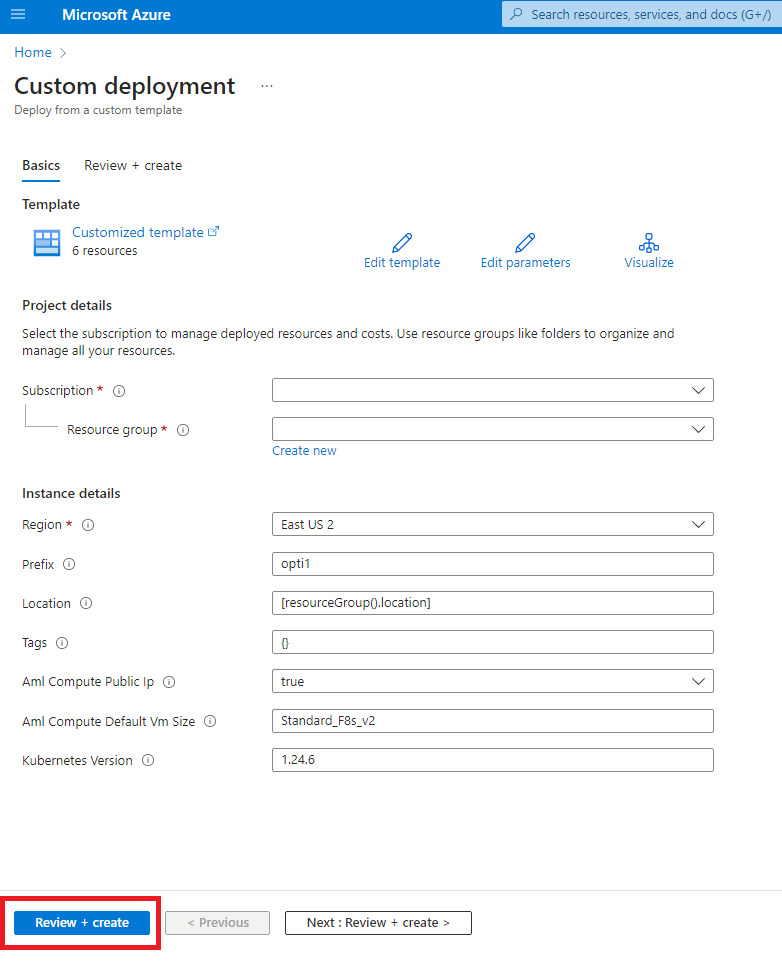

# Solution Deployment
Organizations have different policies and processes in place which lead them to opt for a manual or automated deployment strategy.
We provide 2 different options to deploy the architecture and resources needed to run the solution.

Both options will help you deploying the following resources:
- Azure Key Vault
- Azure Storage (Standard LRS)
- Azure Container Registry
- Azure Application Insights
- Azure Machine Learning (with Azure Kubernetes Services Inferred Compute Instance - Default: Standard_F8s_v2)
- Azure SQL Database (with random credentials)

## Deploy the architecture through Azure Portal by using pre-configured Azure Deployment

There was an error downloading the template from URI 'https://raw.githubusercontent.com/msmarti/sa-opti-temp/main/deployment/azuredeploy.json'. Ensure that the template is publicly accessible and that the publisher has enabled CORS policy on the endpoint. To deploy this template, download the template manually and paste the contents in the 'Build your own template in the editor' option below. 

### AML workspace

The files included in this project are an adaptation of [azure quickstart templates](https://github.com/Azure/azure-quickstart-templates/tree/master/quickstarts/microsoft.machinelearningservices/machine-learning-end-to-end-secure)

This screenshot below shows you the resources that will be deployed by the Azure Bicep template. Once you are in the Azure Portal, modify the parameters accordingly with your desired information.

Once the deployment has been completed, save the following information somewhere accessible to you for the later steps of the deployment.

1) AML WORKSPACE NAME
2) SUBSC
3) TENANT
4) 

### Next Steps: Configure the Azure Resources deployed by the Bicep Template in your Subscription

The next steps you will have to take consist of setting up the Azure Resources that have been deployed into your subscription. Refer to the guide [here](user_deployment_assets\README.md).

Clone this repository on your local machine, so you can access it during the later stages.