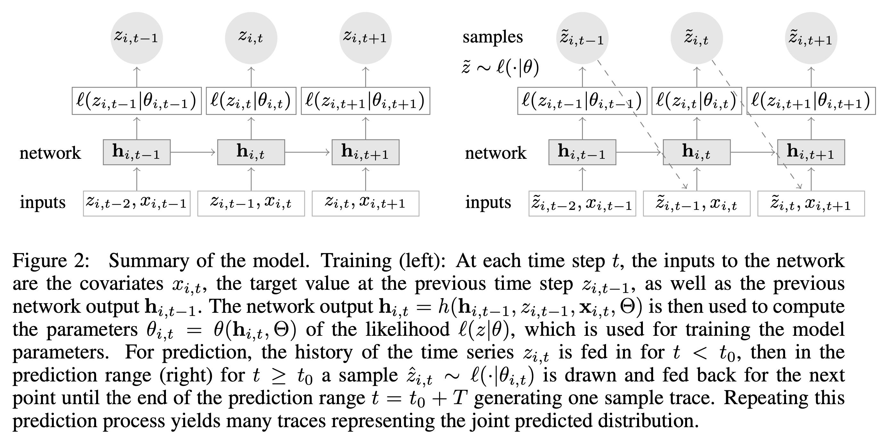

## Explored Techniques and Model Architectures

- Baseline: Monte Carlo Sampling
- Simulation Class code
- Sample from historical sales data up to T-30 days
- Predict sales in the next 30 days

## Deep AutoRegression RNN (DeepAR)

Produce probabilistic forecasts via training an auto-regressive recurrent network model on a group of related time series.



## Transformer

Produce probabilistic forecasts via training an attention-based Transformer model on a group of related time series.

## Forecast with Synthetic Data

Demonstrates the usage of autoregressive deep neural prediction models on synthetic time-series sales data. 
The data generator produces a rich synthetic dataset with many-to-many relationships such as product-location pairs.

The demo code requires the following requirements to be met:
```
gluonts>=0.8.1​
pandas>=1.3​
torch>=1.9​
numpy>=1.21.4​
```

### Step 1: generate synthetic sales data

Define the characteristics of different types of sales data trends by setting parameters such as distribution and number of time periods (days) and number of items per location and locations.
The object generated is a pandas dataframe.

### Step 2: prep data for training/testing
Preprocess generated dataframe to be compatible with the model training object. The probabilistic neural model we are using requires specific objects to be created to capture the (1) time series data and (2) covariates​
Build the training and testing data splits

### Step 3: train the model with DeepAR Estimator

Define model architecture & Commence model training

### Step 4: evaluate model performance

Evaluate and visualize model performance on the test dataset

### Step 5: inference with new data

Forecast on new data and pass the demand output to the optimization problem setup
