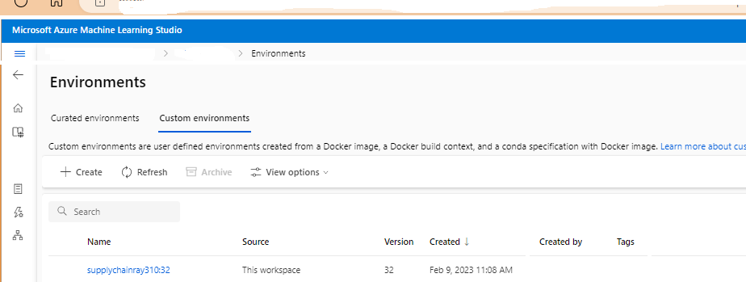
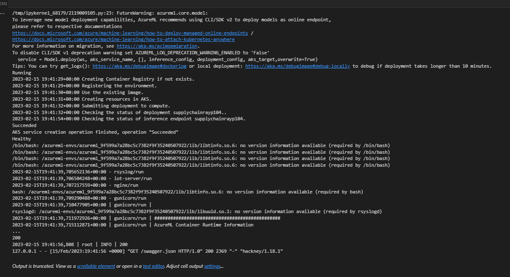
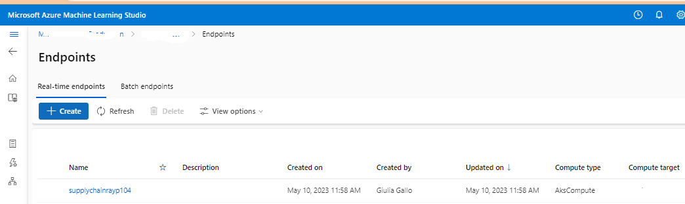
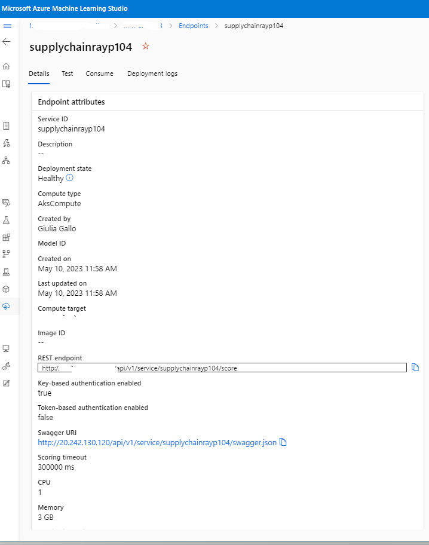

# Azure Machine Learning Configuration Guide

> **Note**
> Estimated time to complete the steps ~ 40 minutes

In this guide, you will perform the following actions:

1) Create a _conda_ virtual environment called *supplychainray377* and register it into Azure Machine Learning.
2) Connect to your AKS instance from Azure Machine Learning studio.
3) Deploy the simulation code file (score.py) on a Kubernetes pod, running the conda environment created on step 1. 

> **Note** Now is the time to upload the copy of this github repository on your AML workspace. 

## Step 1: Create a Conda virtual environment

The conda virtual environment that we are going to create and register in Azure Machine Learning contains the same python libraries that are used to run the score.py file on your local machine, in Jupyter, Visual Studio Code or wherever you run and test your code. The virtual environment is necessary for the AKS pod to run the containerized version of your simulation code and not fail. 

CREATE VIDEO 
Go on your Azure Compute Instance or your local machine, and run the [1.RegisterAMLEnvironment.ipynb](Deploy\AML\1.RegisterAMLEnvironment.ipynb) notebook.

Once the process is completed, you should see the newly registered conda environment in your AML studio:

## Step 2: Connect to your AKS instance from AML and deploy the simulation code on a Kubernetes Pod. 

The last step is for you to run the [2.AKS_Deployment_Notebook.ipynb](Deploy\AML\AKS_Deployment_Notebook.ipynb) notebook. Once you are done running the last cell of the notebook, you will see something similar to these messages below on your terminal. The Keywords to look for are "Ready" and "Healthy". 

VIDEO

VIDEO
You can also follow the deployment process and check the status of your online endpoint from the Azure Portal.

Click on the name of your online endpoint to see the details about the deployment

Next, you are going to setup your Power App to connect to your Ray Cluster and your Azure Resources. Follow the guide [here](../PowerApp/README.md)

