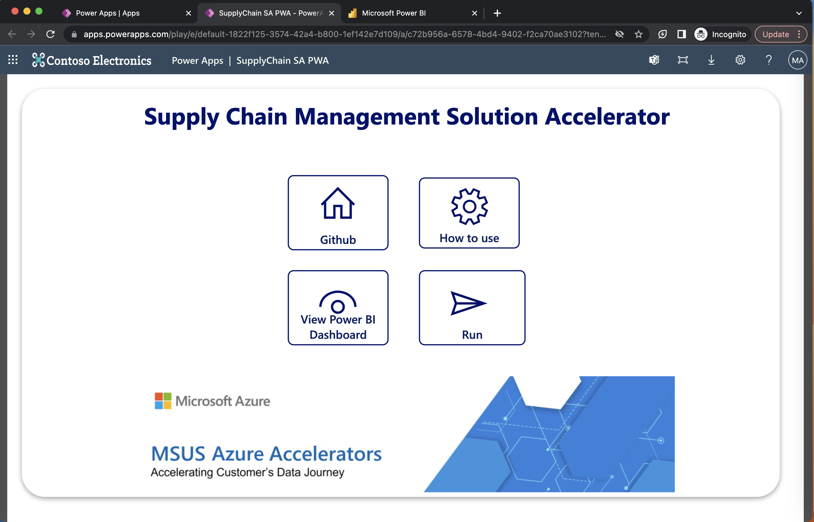

## Deploy and configure the Supply Chain Power App

> **Note**
> Estimated time to complete the steps ~ 10 minutes

In this guide, you will install and deploy the Supply Chain Power App developed for this Solution Accelerator. We assume you have a Power App license.

The Power Apps is simple to navigate and has three screens:

> Home Screen

> Instructions Screen

> Run Screen

### Import a Canvas App 

Go to https://make.preview.powerapps.com/ and get ready to import the Supply Chain Power App provided in this github repository. 

> Check this [YouTube tutorial](https://www.youtube.com/watch?v=QYZEmCedSr8) to see steps to deploy a generic Power App, and repeat the steps using the canvas App in this folder.

### Check the URLs for the Supply Chain Dashboard in your Power Apps

The last step is to add your URL for your PowerBI report into the Power Apps and republish it/play it. 

Edit your Power Apps:

On the Home Page button, you have to click on the View PBI dashboard. Go grab the URL for your Power BI Report and put update the existing URL for your Power BI dashboard.

Change the URL with the correct one, refresh the Power Apps and publish it again.

---

After completing these steps, you'll be ready to use the Power Apps to launch your simulations :)
---

