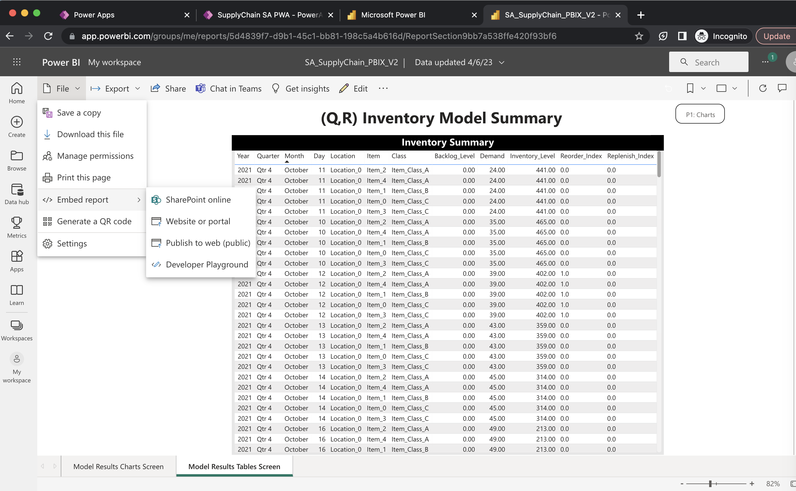

## Power BI Dashboard Set Up

> **Note**
> Estimated time to complete the steps ~ 15 minutes

First off, if you don't have it, go download Power BI Desktop [here](https://www.microsoft.com/en-us/download/details.aspx?id=58494)

Next, open the Power BI report in this repository using your PowerBI account. Click on File, Embed Report, and select the option "". In the  

Save the URL for your Power BI report because you will need it with your Power Apps.

