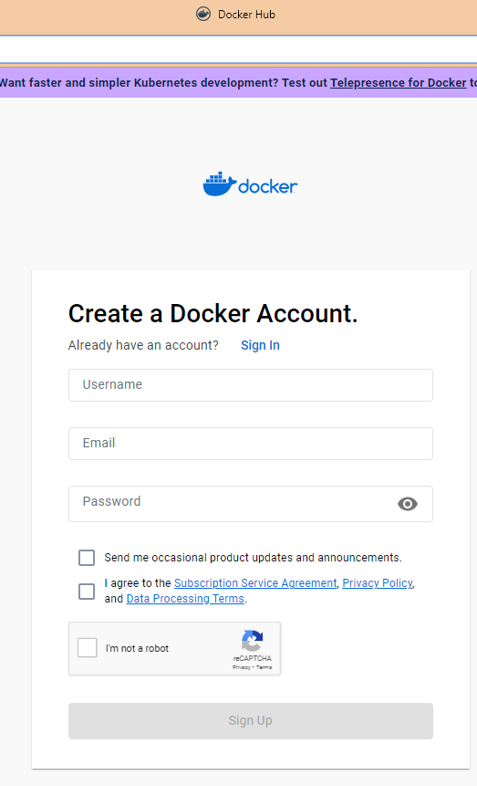

# Introduction to Ray and Ray Clusters

Ray is an open-source distributed computing framework that makes it easy to build efficient and scalable applications for machine learning, 
reinforcement learning, and other compute-intensive tasks. It provides a high-level API for parallel and distributed computing, and includes support for distributed data processing, 
distributed training of deep learning models, and distributed reinforcement learning.

Ray makes it easy to spread out computer tasks, like machine learning or data processing, across many computes. It can work on just one compute, or on many connected computes called a "cluster". 

> For more information on the Ray.io framework, please visit the project homepage: [Ray](https://www.ray.io/)

To use Ray on multiple computes, you first need to set up a *Ray cluster*, a group of computes connected to each other and ready to share work. 
Clusters can be a set size or they can change in size depending on how much work needs to be done.

## Installing Ray on your Azure Kubernetes instance

In this deployment guide, we will follow some of the instructions and details you can find on the official Ray documentation. 

> **Warning**
> This solution accelerator was developed using the rayVersion: '2.2.0'. 

For more general information and other deployment scenarios, please visit this [link](https://docs.ray.io/en/latest/cluster/getting-started.html).

### Installation Phases


---

## Phase 1: Check the Software Prerequisites

Here's a list of software and code repository you will need to have installed on your local machine. 

- Kubectl v4.5.4 or above [kubectl](https://kubernetes.io/docs/tasks/tools/).

> Installation Videos:
> [Windows 10 Guide](https://www.youtube.com/watch?v=G9MmLUsBd3g)
> [Mac OS Guide]([https://www.youtube.com/watch?v=G9MmLUsBd3g](https://www.youtube.com/watch?v=fXE1Gu71XNM)


- [Docker Desktop](https://docs.docker.com/desktop/)
- [Azure CLI](https://docs.microsoft.com/en-us/cli/azure/install-azure-cli)
- [Python - v3.10.9](https://www.python.org/downloads/)


--- 

## Phase 2: Get your Azure Portal and Deployment variables

Retrieve the following info from your Azure Portal deployment executed in the Deployment Phase. You will need these variables and names later.

```
AZURE_SUBSCRIPTION_NAME
AZURE_TENANT_ID
AZURE_KUBERNETES_INSTANCE
AZURE_RESOURCE_GROUP
```
----


## Phase 3: Prepare a Docker image to install on your AKS instance

In this phase, you will build a Docker file image to be installed on your Ray Cluster in the subsequent phases. Docker is a tool that helps you build, test, ship and run applications
seamlessly across various machines. It replicates the environment our software needs on any machine. 

### Phase 3.1 Install Docker Deskotp

You can get Docker for your machine from https://docs.docker.com/get-docker/. 


### Phase 3.2 Sign-up for a Dockerhub account

After installing Docker, you will have to sign up for an account on [Dockerhub](https://hub.docker.com/signup) in order to be able to push and pull your Docker images for your deployments.



More commands can be found at https://docs.docker.com/engine/reference/commandline/docker/


### Phase 3.3 Build your Dockerfile image and push it to Dockerhub

The Dockerfile is a blueprint of a Docker image. We can mention the artifacts from our application along with their configurations into this file in the specific syntax to let anyone create a Docker image of our application.


### A few things to keep in mind:
* It is always strictly named `Dockerfile` without any extensions
* We have to build our custom image on top of some already available Docker base 
image. (there is an empty image called `scratch` which literally lets you build
an image from scratch)
* All capitalised commands are part of the syntax, they are not case-sensitive
but used like a convention


Below is the Dockerfile we provide you, and you can also read in depth from the [official docs](https://docs.docker.com/engine/reference/builder/).

```Dockerfile
FROM rayproject/ray:2.2.0-py310-cpu

USER root:root

# apt-get and system utilities

RUN apt-get update \
  && apt-get -y install apt-transport-https \
  && apt-get -y install apt-utils \
  && apt-get -y install curl \
  && apt-get -y install gcc \
  && apt-get -y install g++ \
  && apt-get -y install unixodbc unixodbc-dev \
  && apt-get clean

# adding custom MS repository
RUN curl https://packages.microsoft.com/keys/microsoft.asc | apt-key add -

## TBD - upgrade to 20.04 and test
RUN curl https://packages.microsoft.com/config/ubuntu/18.04/prod.list > /etc/apt/sources.list.d/mssql-release.list

# install SQL Server drivers
RUN apt-get update && ACCEPT_EULA=Y apt-get install -y msodbcsql17

# install SQL Server tools
RUN apt-get update && ACCEPT_EULA=Y apt-get install -y mssql-tools
RUN echo 'export PATH="$PATH:/opt/mssql-tools/bin"' >> ~/.bashrc
RUN /bin/bash -c "source ~/.bashrc"

# python libraries
RUN apt-get update && apt-get install -y \
    python3-pip python3-dev python3-setuptools \
    --no-install-recommends \
    && rm -rf /var/lib/apt/lists/*

# install necessary locales
RUN apt-get update && apt-get install -y locales \
    && echo "en_US.UTF-8 UTF-8" > /etc/locale.gen \
    && locale-gen

RUN pip3 install --upgrade pip

# install SQL Server Python SQL Server connector module - pyodbc
# TBD - versions in this list might change depending on new releases and dependencies  
RUN pip3 install pyodbc
RUN pip3 install pyomo
RUN pip3 install cplex
RUN pip3 install protobuf==4.21.11
RUN pip3 install azureml-defaults
RUN pip3 install inference-schema
RUN pip3 install joblib
RUN pip3 install sqlalchemy
RUN pip3 install matplotlib
RUN pip3 install ray[default] gluonts torch mxnet orjson

```

In order to build your dockerfile image, open a bash terminal, and navigate to the folder where you cloned this repository. 
The command you will have to launch will be as below:

```bash

$docker build <path-to-dockerfile>
# used to build an image from the specified Dockerfile
# instead of path we could also specify a URL
# -t tag is optional and used to name and tag your images for e.g.
# `$docker build -t my-image:0.1 ./home/app`
# rebuild images everytime you make changes in the dockerfile
```
You can specify a tag, it's up to you.

### 3.1 Push your image to DockerHub
The next step will be pushing the image you just built to your Dockerhub address. The image will be pulled during the configuration of the RayCluster, so that's why it has to be publicly available. 

When pushing an image to Docker Hub, we must specify our Docker Hub username as part of the source image name. We need to create the target image with the tag name of username/image-name much like GitHub repositories. The commands below show you how to push the image you built to your Dockerhub phase above. 

```bash
$docker login
# to login to Docker Hub using your username and password

$docker tag <src-image>[:<src-tag>] <target-image>[:<target-tag>]
# this tags a local src-image to a public target-image
# e.g. `docker tag my-sample-app:1.0.0  akshitadixit/my-sample-app`
# if tags are not specified, they're defaulted to `latest`

$docker push <target-image>[:<target-tag>]
# uploads our image to Docker Hub
# e.g. `docker push akshitadixit/my-sample-app`
# this image will be accessible under your profile's repositories as
# `https://hub.docker.com/r/username/image-name`

```

----

## Phase 4. Create and App Registration on your Azure Portal, to allow the Ray pods to read the AKV secrets.

You wil need to create an App registration for your Ray Cluster, using the Microsoft identity platform by registering it in your Azure Portal. Because you need an trust relationship between your application and the client's web API, using the Microsoft identity platform performs identity and access management (IAM) will allow you to do so.  The trust is unidirectional: your app trusts the Microsoft identity platform, and not the other way around. Once created, the application object cannot be moved between different tenants.


Follow these steps to create the app registration:

1. Sign in to the <a href="https://portal.azure.com/" target="_blank">Azure portal</a>.
1. If you have access to multiple tenants, use the **Directories + subscriptions** 
1. Search for and select **Azure Active Directory**.
1. Under **Manage**, select **App registrations** > **New registration**.
1. Enter a display **Name** for your application. Users of your application might see the display name when they use the app, for example during sign-in.
   You can change the display name at any time and multiple app registrations can share the same name. The app registration's automatically generated Application (client) ID, not its display name, uniquely identifies your app within the identity platform.
1. Specify who can use the application, sometimes called its _sign-in audience_. Select **Accounts in this organizational directory only** for your audience.

1. Don't enter anything for **Redirect URI (optional)**. You'll configure a redirect URI in the next section.
1. Select **Register** to complete the initial app registration.

When the registration finishes, the Azure portal displays the app registration's **Overview** pane. You see the **Application (client) ID**. Also called the _client ID_, this value uniquely identifies your application in the Microsoft identity platform.

> [!IMPORTANT]
> New app registrations are hidden to users by default. When you are ready for users to see the app on their [My Apps page](https://support.microsoft.com/account-billing/sign-in-and-start-apps-from-the-my-apps-portal-2f3b1bae-0e5a-4a86-a33e-876fbd2a4510) you can enable it. To enable the app, in the Azure portal navigate to **Azure Active Directory** > **Enterprise applications** and select the app. Then on the **Properties** page toggle **Visible to users?** to Yes.

Your application's code, or more typically an authentication library used in your application, also uses the client ID. The ID is used as part of validating the security tokens it receives from the identity platform. Once your application is deployed, you should see something like this in your browser:


### Phase 4.1 Add the client secret for the Azure KeyVault and the Azure Kubernetes Instance

Sometimes called an _application password_, a client secret is a string value your app can use in place of a certificate to identity itself. Client secrets are considered less secure than certificate credentials. Application developers sometimes use client secrets during local app development because of their ease of use. However, you should use certificate credentials for any of your applications that are running in production.

1. In the Azure portal, in **App registrations**, select your application. 


1. Select **Certificates & secrets** > **Client secrets** > **New client secret**.
1. Add a description for your client secret.
1. Select an expiration for the secret or specify a custom lifetime.
    - Client secret lifetime is limited to two years (24 months) or less. You can't specify a custom lifetime longer than 24 months.
    - Microsoft recommends that you set an expiration value of less than 12 months.
1. Select **Add**.
1. _Record the secret's value_ for use in your client application code. This secret value is _never displayed again_ after you leave this page.

For application security recommendations, see [Microsoft identity platform best practices and recommendations](../articles/active-directory/develop/identity-platform-integration-checklist.md#security).


## Phase 5: Deploy the KubeRay operator on your AKS instance from your local machine

After deploying the necessary Azure resources, the next step is to install the KubeRay operator and the Ray Cluster on your Azure Kubernetes instance. This guide will show you how to install Ray on AKS, starting from your own local machine (laptop, desktop pc, etc.) and which tools you'll need to do so.


1. Open your bash shell and connect to your Azure tenant and subscription, and your AKS instance as described below in the code snippet.

```
az login --tenant INSERT YOUR MSFT TENANT ID HERE
az aks get-credentials -g AZURE RESOURCE GROUP YOU DEPLOYED -n AKS INSTANCE ID YOU DEPLOYED --overwrite-existing
export KUBECONFIG=/mnt/c/Users/YOURPATH/.kube/config

```

> **Note**: These commands will allow you to communicate to your AKS instance from now on using *kubectl*. 
> Move to the folder where you have downloaded the github repository of the latest ray.io code. 
> This guide assumes you are launching these commands from there.


Finally, the last step you need to take is to install the KubeRay Operator on your AKS instance. You will need the following information from the steps above:

- The url for the Docker image that you pushed to Dockerhub during Phase 3.


- The secret's API/app client secret from the App your registered during Phase 4.1


> **Note**
> We will be following the *Getting Started* guide referenced below from the Ray documentation, so if you are interested in learning more details about Ray and Kubernetes, please go to this [link](https://> docs.ray.io/en/latest/cluster/kubernetes/index.html).


### 5.1 Access your Azure Kubernetes instance


Making sure that you have installed all the prerequisite software mentioned in the guide above, open a new bash terminal and connect to your AKS cluster with the commands below.

```

az login --tenant YOUR_TENANT_ID
az aks get-credentials -g AZURE_RG -n AKS_ID --overwrite-existing

```

Now proceed to instantiate a KubeRay Operator on your AKS instance with this command:
```
kubectl create -k "github.com/ray-project/kuberay/ray-operator/config/default?ref=v0.3.0&timeout=90s"
```

Now you will have to make two small changes to the ray-cluster.autoscaler yaml file, using your dockerhub image. This will allow your Ray cluster to run with the image and environment you built above.
In a nutshell, both the Ray head and the workers that you are deploying will need to have the same dockerhub image/environment to connect and work properly with one another. 

1. First change 


1. Second change 


Save everything, and from the local folder where you saved you raycluster autoscaler yaml file, run this command:

```
kubectl apply -f ray-cluster.autoscaler.yaml
```
For the RayCluster to communicate to your AML score file and application pod that you will deploy in the next phase, you will have to exchange secrets between the Raycluster and your App registered in the phase above. Now it's the time to get your client secret that you should have saved in phase 4. Copy and paste the client secret on the file called _sp_secret.yaml_

```

apiVersion: v1
kind: Secret
metadata:
  name: spsecret
type: Opaque
data:
  sp-akv: COPY THE SECRET HERE

```


Save and from terminal, install the service/pod with the secret. 
```
kubectl apply -f sp_secret.yaml
```

To see that the Ray cluster is working correctly, you can check the Ray Dashboard on your web-browser. You will have to open the ports for the Dashboard to do so. Remember that this operation is a blocking command, meaning that it will freeze your terminal. It's highly recommended you run this command in another bash terminal. 

```
kubectl port-forward service/raycluster-austoscaler-head-svc 8265:8265
```

Here are other useful commands for accessing the Kubernetes resources.

To delete the RayCluster on your terminal, run this command:
> kubectl delete raycluster raycluster-autoscaler

To delete the RayOperator in the ray-system namespace, run this command: 
> kubectl delete -k "github.com/ray-project/kuberay/ray-operator/config/default?ref=v0.3.0&timeout=90s"

This is a list of useful _kubectl_ commands:
```
kubectl get pods -A
kubectl get service YOUR RAY CLUSTER SERVICE
```

## Step 7 - Deploy the Supply Chain Management AML simulation to your AKS

Now you are ready to deploy the inventory solution to your AKS instance. Go to this folder and follow the steps in the [README.md](../AML/README.md) guide.
