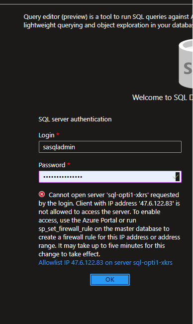

## Azure SQL Deployment Guide

In this guide, you will perform the following actions:

- import the Azure SQL database file to your Server 
- add your IP to the server firewall to access it

### Upload the SQL bacpac file to your Azure storage account

Select the SQL bacpac file here, and upload it to a new container in your Azure storage account. You are also welcome to save it to your local machine

### Import the supplychain SQL database to your Azure SQL db

Select the SQL bacpac file [here](supchaindb.bacpac), and using Microsoft SQL Server Management Studio (SSMS) or any other tool of your choice, import the file into your Azure SQL server.
For a video guide, follow the steps in this video, on how to create a new SQL database using a bacpac file. 

> [Guide + video](https://learn.microsoft.com/en-us/azure/azure-sql/database/database-import?view=azuresql&tabs=azure-powershell)

> **Note**
> feel free to remove/delete any existing databases on your server that you won't be using.  

### Add your IP to the Azure SQL server firewall

Once you have successfully imported the Supply Chain Azure SQL database into your SQL server, before you will be able to connect to it, you will have to add your local machine's IP to the Azure SQL server firewall, as shown in the image here below. 

